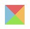
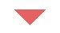

三种纯CSS实现三角形的方法
======================

### 1.利用border属性实现三角形
> 这个原理很简单，我们先看一下下面的图，这个边框为20px的div，是一个提醒，变化会从这里开始。

> 

> css:

```css
	
	.triangle {
		width: 30px;
		height: 30px;
		border-width: 20px;
		border-style: solid;
		border-color: #e66161 #f3bb5b #94e24f #85bfda;
	}

```

> 好的，现在我把它的宽高都设成0，看看有什么变化。
> 
> 

> 四个边框都编程了三角形，现在我在把它的左右和下边框的颜色都设陈透明灰和背景色相同弄的颜色，就出来我们想要的三角形了，推荐把边框设置成透明，这样拓展性更好。
> 
> 注：IE6下把边框设置成transparent时会出现黑影，并不会透明，把border-style设置成dashed可以解决。
> 
> 

```css
		
	.triangle {
		width: 0;
		height: 0;
		border-width: 20px;
		border-style: solid dashed dashed dashed;
		border-color: #e66161 transparent transparent transparent;
	}

``` 

> 如果我们想实现如下图的效果怎么办？很简单，做两个小三角，一个是背景色一个是边框色，然后利用定位重叠在一起，记住他们他们的定位要相差一个像素

> 

```html

	<div class="message-box">
	  <span>我是利用 border 属性实现的</span>
	  <div class="triangle-border tb-border"></div>
	  <div class="triangle-border tb-background"></div>
	</div>
	
```

```css

	.message-box {
	    position:relative;
	    width:240px;
	    height:60px;
	    line-height:60px;
	    background:#E9FBE4;
	    box-shadow:1px 2px 3px #E9FBE4;
	    border:1px solid #C9E9C0;
	    border-radius:4px;
	    text-align:center;
	    color:#0C7823;
	}
	.triangle-border {
	    position:absolute;
	    left:30px;
	    overflow:hidden;
	    width:0;
	    height:0;
	    border-width:10px;
	    border-style:solid dashed dashed dashed;
	}
	.tb-border {
	    bottom:-20px;
	    border-color:#C9E9C0 transparent transparent transparent;
	}
	.tb-background {
	    bottom:-19px;
	    border-color:#E9FBE4 transparent transparent transparent;
	}

```

###　２.利用”◆“字符实现三角形

> 字符实现也是要用两个字符来决定定位去模拟，只是他不能模拟出三角形，他是个另行，然后漏出半个头，底色又和背景色一样，看上去就像个三角形。
> 
> 注：它的大小是又font-size决定的，width和height都决定不了，但最好还是加上，这样各个浏览器去省城这个字符的时候能保持一致，我们去屑绝对定位的时候就不用hack了。

```html
	
	<div class="message-box">
	  <span>我是利用 ◆ 字符实现的</span>
	  <div class="triangle-character tc-border">◆</div>
	  <div class="triangle-character tc-background">◆</div>
	</div>
	
```

```css

	.message-box {
	    position:relative;
	    width:240px;
	    height:60px;
	    line-height:60px;
	    background:#E9FBE4;
	    box-shadow:1px 2px 3px #E9FBE4;
	    border:1px solid #C9E9C0;
	    border-radius:4px;
	    text-align:center;
	    color:#0C7823;
	}
	.triangle-character {
	    position:absolute;
	    left:30px;
	    overflow:hidden;
	    width:26px;
	    height:26px;
	    font:normal 26px "宋体"; // 字符的大小和字体也有关系哦！
	}
	.tc-border {
	    bottom:-13px;
	    color:#C9E9C0;
	}
	.tc-background {
	    bottom:-12px;
	    color:#E9FBE4;
	}

```

### 3.利用css3 transform旋转45度来实现三角形

> 先创建一个带border的div，设置好背景色和相邻的两个边框颜色，然后选择45度，但是想要兼容IE需要使用matrix filter来实现css3 transform（如果一定要要兼容IE，直接做一个小三角的图会更好一些）

```html

	<div class="message-box">
	  <span>我是利用 css transfrom 属性字符实现的</span>
	  <div class="triangle-css3 transform ie-transform-filter"></div>
	</div>
	
```

```css

	.message-box {
	    position:relative;
	    width:240px;
	    height:60px;
	    line-height:60px;
	    background:#E9FBE4;
	    box-shadow:1px 2px 3px #E9FBE4;
	    border:1px solid #C9E9C0;
	    border-radius:4px;
	    text-align:center;
	    color:#0C7823;
	}
	.triangle-css3 {
	    position:absolute;
	    bottom:-8px;
	    bottom:-6px;
	    left:30px;
	    overflow:hidden;
	    width:13px;
	    height:13px;
	    background:#E9FBE4;
	    border-bottom:1px solid #C9E9C0;
	    border-right:1px solid #C9E9C0;
	}
	.transform {
	    -webkit-transform:rotate(45deg);
	    -moz-transform:rotate(45deg);
	    -o-transform:rotate(45deg);
	    transform:rotate(45deg);
	}
	/*ie7-9*/
	.ie-transform-filter {
	    -ms-filter: "progid:DXImageTransform.Microsoft.Matrix(
	        M11=0.7071067811865475,
	        M12=-0.7071067811865477,
	        M21=0.7071067811865477,
	        M22=0.7071067811865475,
	    SizingMethod='auto expand')";
	    filter: progid:DXImageTransform.Microsoft.Matrix(
	        M11=0.7071067811865475,
	        M12=-0.7071067811865477,
	        M21=0.7071067811865477,
	        M22=0.7071067811865475,
	    SizingMethod='auto expand');
	}

```


